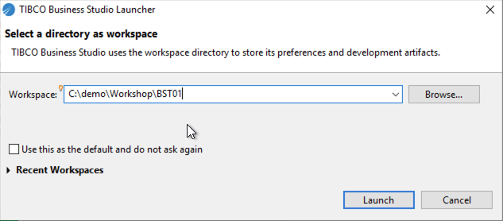

# Build a Project Components Explained

Instructions to build a project through Business Studio. Test Change

# Build Components step by step
Open TIBCO Business Studio and select a new empty folder for your project. This is an example of a workspace location, C:\demo\Healthcare\BST01. 

Always create a new workspace for a new project. Artifacts can be shared but it is still recommended to import an artifacts into the new project if you want to reuse it. If you are planning to change anything in the shared artifact, you will need to change the name of the artifact or it will clash with an existing deployed project. 

## Project Artifact Types
These are the project artifacts we will be using to build the solution in this workshop. The section in the brackets are the naming convention that is used to make the project recognizable. e.g. dispute_bom. You will notice that we always use camel casing for variable as well as project artifact names. 

In this section we will highlight some terminology that you may already know but it is important in this workshop.

Lets tart building the data model
## Next Step: [Building the Business Object Model (_bom)](business_Object_Model.md)

