# Business Services (_businessServices)

Business Services are used to initiate new long-running processes, start cases, and also to do basic CRUD operations, whether on BPM case data or other systems of record.
In this lab, we will create a Business Service in a separate project to capture a new dispute.

Select File->New->BPM process Project like you did when we created the Forms Project. Enter the name of the project and note the Id that is automatically generated. You will see the default name start with com.example. This can be changed in the Studio Preferences if you want. It would make sense to be something like com.<customer name>.<solution name>_businesservices. This is completely optional, but it will be very handy as this is what you will see when the project is deployed to the BPM server.

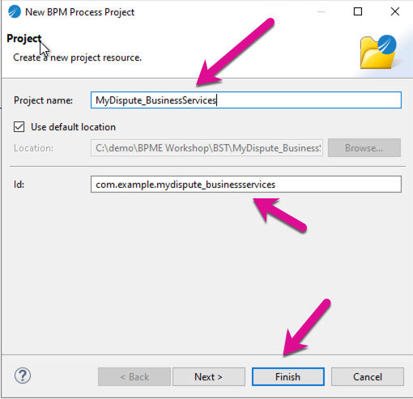

Your project structure now looks like this.

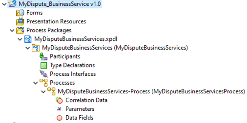

You will see that a process MyDisputeBusiunessServices is automatically created. We could change the name to CaptureDispute.
We can go ahead and delete this process for now, but just in case you want to re-use this process to build a business service from scratch, follow the following steps.

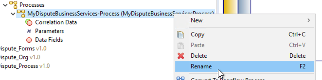

A Business Service is a special type of pageflow. To change the process (the yellow process) to a business service, we need to change the type to pageflow process and then mark the pageflow to be exposed as a business service. Right-click the process and select Convert to Pageflow Process.

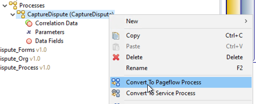

Now, select the properties of the process and select Publish as a Business Service checkbox. Also, change the Business Category to MyDispute.

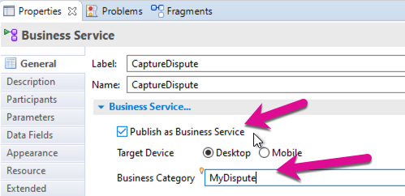

Let us create a Business Service from a template. Business Studio provides templates to make the building of processes much easier and quicker. Right-click on Processes and select Business Services.

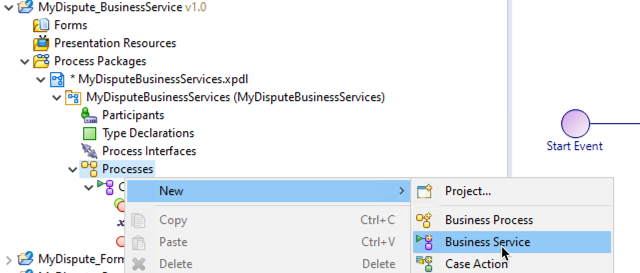

New complete the New Process Wizard to look like this. Add a Label and Select Create Case Data Business Service Process. This business service will have a form to handle the data capture, a service task to create the case, and also handle any errors that may occur.

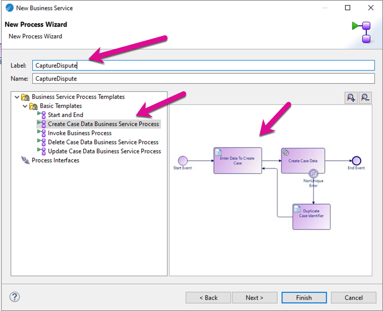

You will notice the process is created but it has some errors. We need to fix that to make sure the process will run. The errors are because of the data fields that have not been defined correctly. We need to select the BOM types for the case data field and reference fields.  

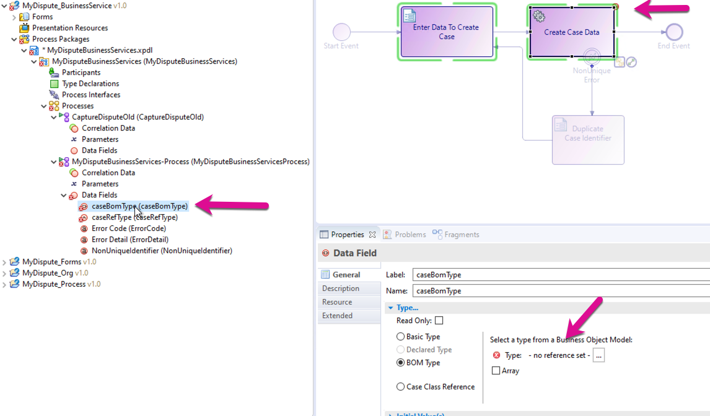

I prefer to have my case data fields be more descriptive. Let's change the name and select the bom case class for the caseBomType Field. Call the field Dispute and select the correct case type.

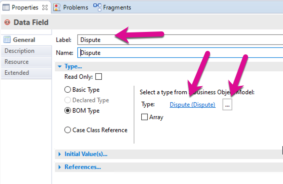

Do the same to the caseRefType data field and call it Dispute Ref. The errors on the 2 data fields should disappear after you save your project, however, there is still an error on the Create Case Data Service Task. 

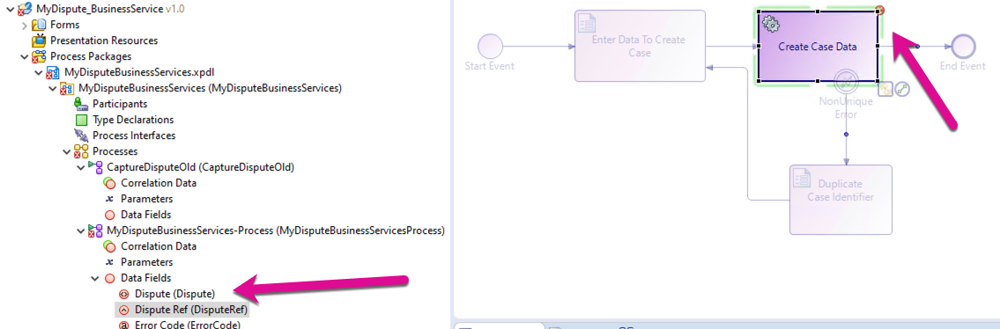

The reason is that the service task also needs to be configured to update the correct BOM case. Click on the 3 ellipses and select the Dispute class. After this, your error should not disappear and the process should function correctly.

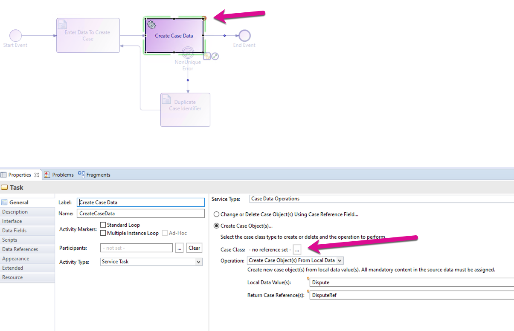

Select the Enter Data To Create Case user form in the process. You will see the Use Default Form radio button is selected. Change it to Form. You may see a pop-up, just click on OK to proceed and create a new form. This will override the default form the system creates. 

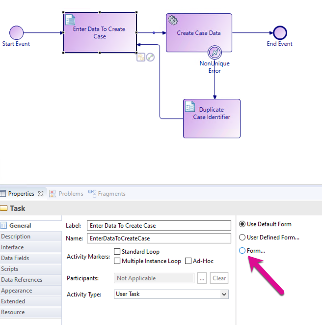

We want to customize the default form. Now click on Open, to display the form. You should see a form looking like this.

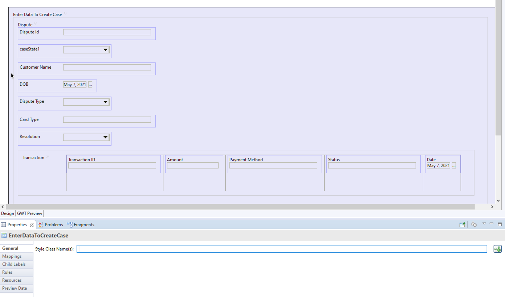

We want to use the Embedded form we created earlier. Lets delete the current form and replace it with the embedded form. 

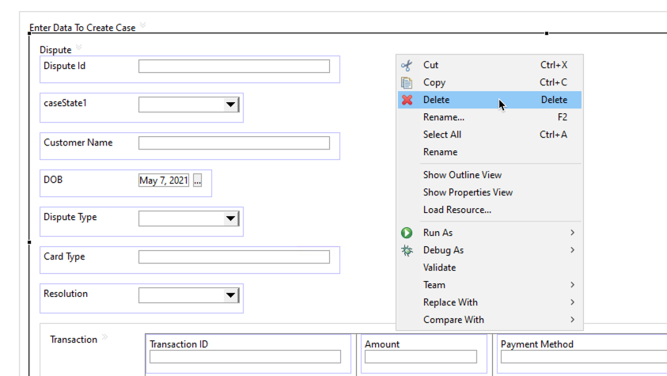
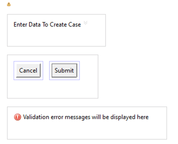

In the forms control palette, select the embedded form control and drop the selected control on the empty frame. Select the Dispute form in the Select form to embed dialog.

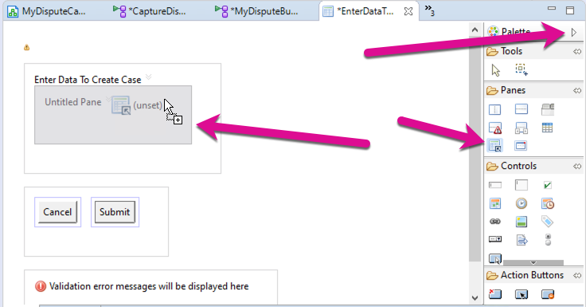

Click Yes on the pop-up dialog. 

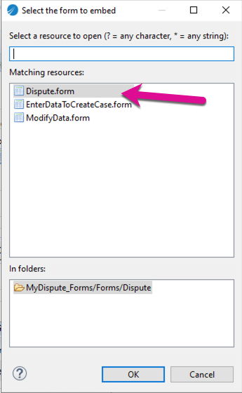

You need to now create a mapping to send the parameter data from the form to the embedded form. Make sure to map the value of the parameter.

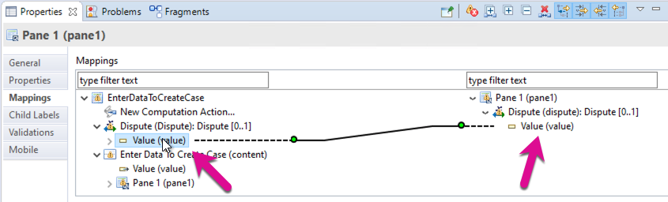

If you preview your form, it should now look like this. We will make some other minor changes a little later. This process should not we ready to deploy.

## Next Step: Deploy and test the BOM, Business Services and Forms projects.
## [First Deployment](first_Deployment.md)