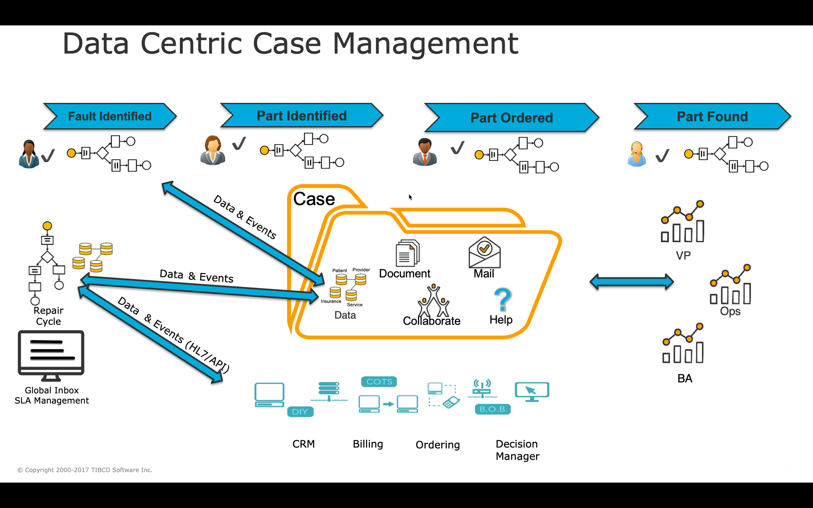
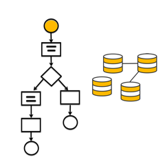
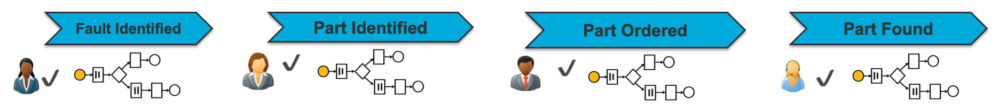
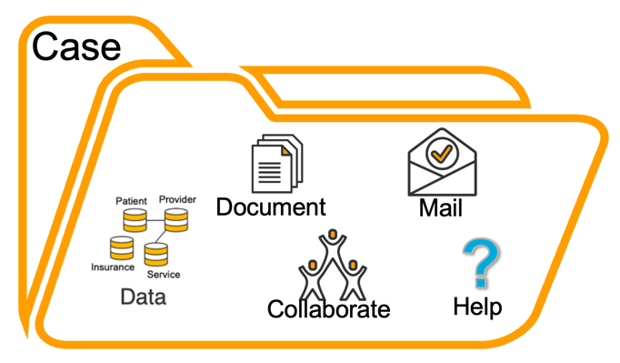
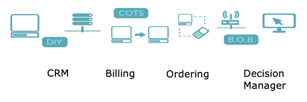
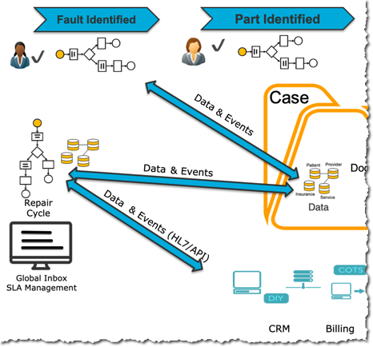
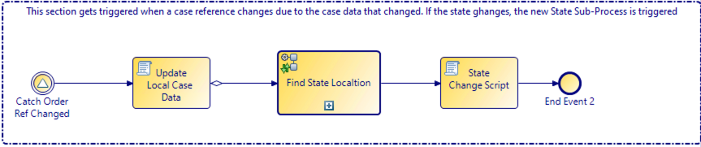
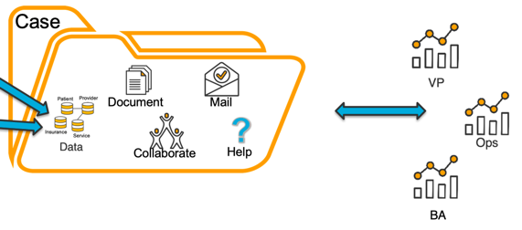

# Understanding Case Management Framework Implementation
Case Management brings a lot of functionality to a BPM solution implementation. All the implementation capabilities are not that obvious. We created this lab to illustrate this implementation methodology. I have a video on TIBCO Academy to explain this section below. https://academy.tibco.com/share/asset/view/394

The slide below is a good illustration of such an implementation. 

In this implementation, we created is a solution that makes use of both long-running as well as short-lived processes. We have some custom solutions that use only short-lived processes (Case Actions and/or Business Services) for their entire banking fraud management back-office solution. One thing that short-lived processes do not do is managing SLA's/timer events; this type of functionality ensures work gets done in a predefined time. 

Case Management provides a lot of flexibility on top of the typical BPM solution. Using Case Management, the long-running process steps are replaced with states/milestones that make up an end-to-end process. These states/milestones are not statically linked. A long-running process is modeled to execute steps of a process in sequence or parallel; the state model allows you to process multiple state processes in any order based on the business rules for the process execution. The ability to create stateless CRUD processes (case actions or business services) allows users to update case states without the need to process a work item associated with a process step. 

## Long-Running Processes
Take this process below. In this process, every step needs to be executed in the order that it is modeled. If the order of the steps needs to be changed, the process definition needs to change, and the process needs to be re-deployed. Re-deploying a long-running process requires the migration of existing process instances that takes effort and careful consideration. 

## Stateless processes
In the process below, we defined the high-level states/milestones. These steps represent the process for fault resolution. Every state represents a stateless process. Because the state processes are stateless, it brings flexibility in that the user can update the state through a stateless process, and based on the business rules, and the process is processed to the next appropriate state. Stateless processes are easier to upgrade in place. Stateless processes do not have data like long-running processes to upgrade. Stateless processes fetch data in the central repository at the current state to present to the user. Case actions can represent CRUD processes as they allow the user to modify data associated with a case. 

Stateless processes aren't always the appropriate way to progress a process from state to state. Sometimes, long-running processes are required to keep track of SLA. Using the Case Management Framework (CMF), we created a methodology to manage stateful processes associated with specific states dynamically. This methodology is dynamic and allows solutions to be highly agile. 

## Central Case Date
At the center of this implementation methodology lies the case data repository. A part of this repository also contains the ability to store and upload documents. The BPME engine is a built-in lightweight document store that allows the system to upload and store documents of many types, like PDFs, word, excel, etc. The BPM document store is not an enterprise document repository for large amounts of documents. Organizations that have this requirement often already have large ECM solutions that could integrate into the CMF.

Collaboration is a big part of servicing customers in BPM/Case Management solutions. A Collaboration case type records all comments, questions, and other collaboration around Case Management Solutions. Collaboration used to be native functionality in AMX BPM 4.3, but in BPME 5.0, this functionality needs to be custom build for the time being. 

Email is just another way of collaborating. We implement email collaboration for resources like customers that do not have access to the system. BPME 5.0 can send email through a service task in the process but cannot receive email messages. BusinessWorks scans a central mailbox and links incoming messages to process instances responsible for sending out mail messages. We use signal functionality to accomplish this. 

Custom help functionality can be provided by employing TIBCO Nimbus. Process documentation can be the trigger for business process implementations. These processes could be the ideal business view of process implementations and used to help with minimal changes.

## Integration Layer
BPM Solutions should not replace current systems of record. Data should always stay in a central location, and BPM should only use the data to present to users where required. If changes occur, they should be done directly from the business process at the time of the change. BPM should always only store reference data to allow for finding the data required to complete activities. Business works are the ideal product to accomplish this.

## Events 
In the Case Management Framework (CMF), Event triggers the correct dynamic sub-processes based on the current state of the case. A case data signal event listens to any data changes in a specific case. When the process detects changes, the process implements a mechanism to find the current state, then search for a new state based on an action that triggered the change. This implementation consists of 2 case data tables. The first is the location of processes associated with specific states, and the second is the order of state execution. We will discuss this in more detail later.  

Case Actions, Business Services, and Long-running processes can initiate Event triggers. The process snippet below shows the section of the process responsible for changing a state and triggering the new case state process.

Events can also come from external triggers like BusinessWorks. A good example could be a customer canceling a request for service through an email message. BW can read the email and correlate the message with an existing case that, in turn, could cause the Event to cancel the process/customer request. 

## Analytics

Analytics is an essential piece of the Case management Framework. To better manage user performance Process KPI's you need to visualize the work in the system. We use TIBCO Spotfire to visualize all aspects of the solution. Spotfire is good at visualizing data from the BPM system and data from the entire organization that forms part of any BPM solution, including all record systems. The Spotfire dashboard is exposed inside the CMF UI so that users don't have to load a separate application to see what's going on. TIBCO BPM provides dashboards for users at different levels, like Management, supervisors, and end-users. 
