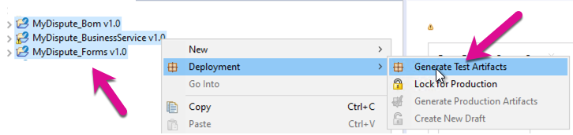
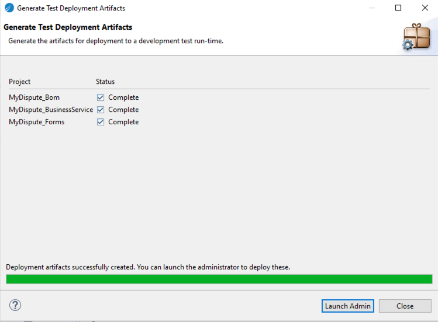
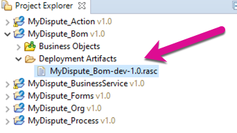
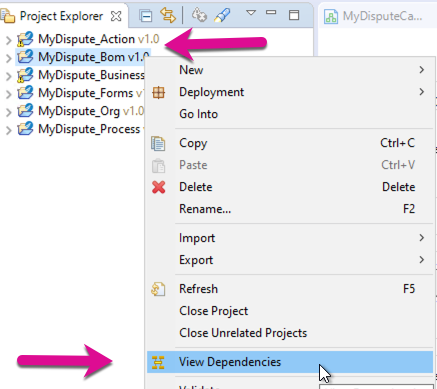
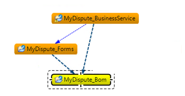
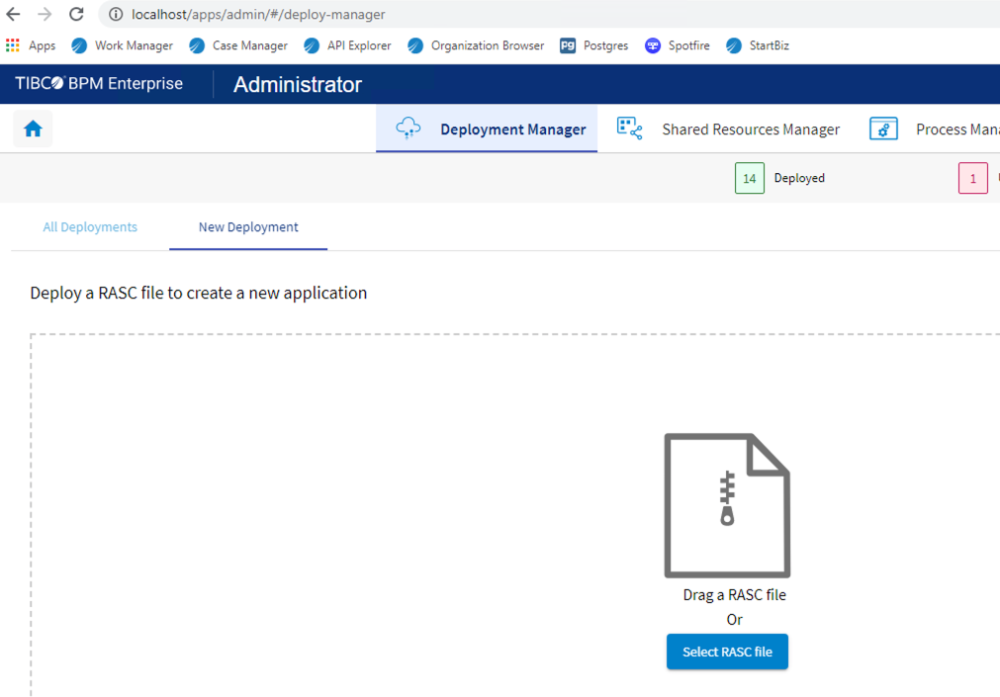
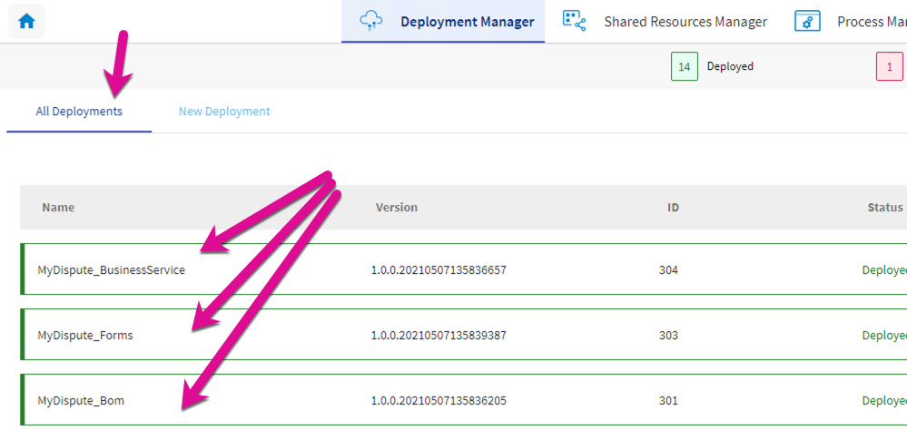

Let's start creating the deployment artifacts. Select the three projects we have built so far.
Right-click and select Deployment->"Generate Test Artifacts"

Confirm the correct projects are selected and click Generate to create the project Artifacts.

A confirmation dialog will show the completion of the artifacts.

Click close and open the Bom project file structure to expose the Newly generated artifacts.

RASC file is the file that we will deploy to the BPM server. You can drag and drop this file on the new deployment screen or select it from the New Deployment Screen.
The order in which we deploy the artifacts is important. Review the dependencies before deployment to make sure the order you need to follow. Make sure you deploy your project from the bottom up.

Log into the TIBCO BPM Administrator and navigate to the Deployment Manager->New Deployment screen.
Make sure to start with the BOM project Artifact. Select Deploy to the ploy the BOM to the BPM Server. You should get a green box notifying you of successful deployment.

Do the same with the Forms and Business Services Artifacts and then confirm completion of deployment.

OK, we have created processes, data, forms and deployed them, let's test the process.
## Next Step: [Test Deployment](test_Deployment.md)