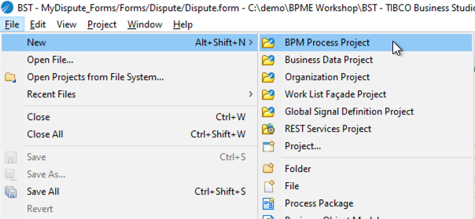
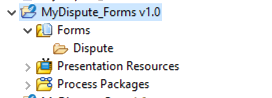
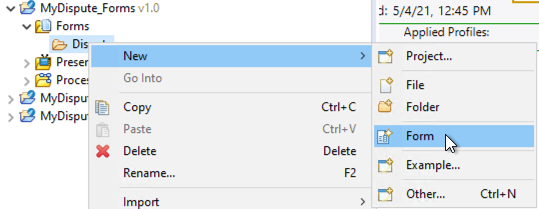
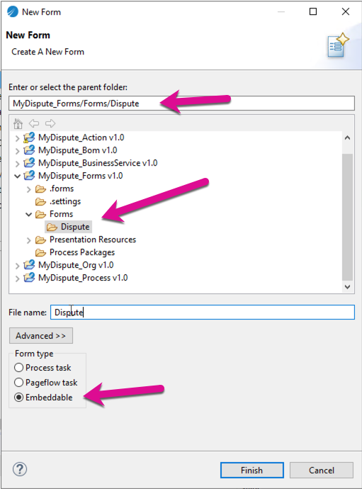
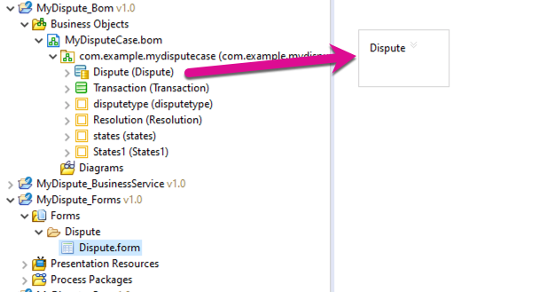
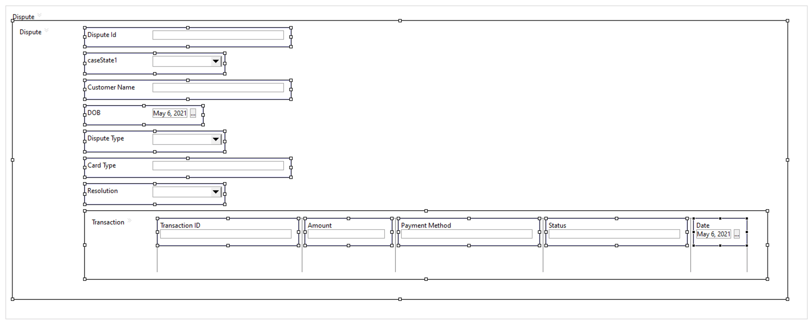
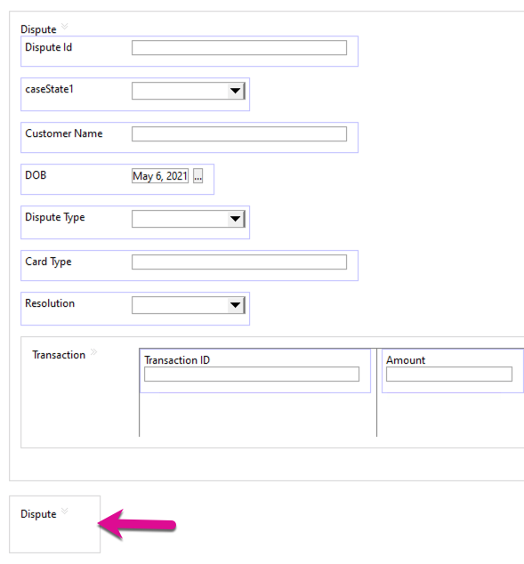
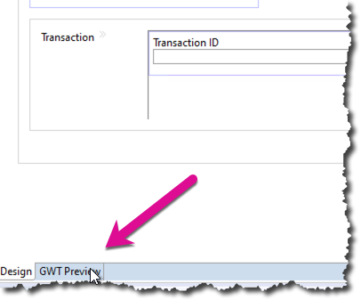
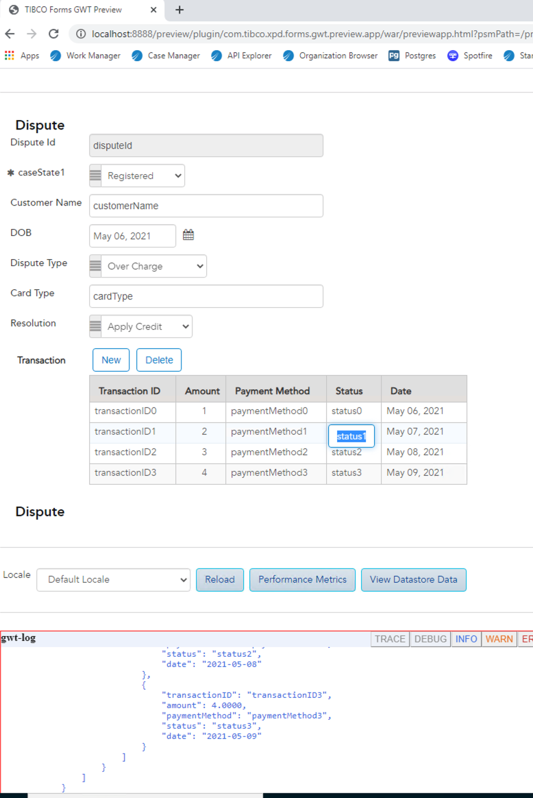

# Forms Project (_forms)
## Embed-able forms
Forms project allow you to create one central place for embed-able forms (forms that are reusable). It makes it very easy to create user interfaces that are consistent throughout your project if you create embed-able forms that is reused in your project. It is a good idea to create a embed-ab;le form for every case or global class in your project and reuse it where needed. This way you can format the form the way you need and then just reuse. Formatting forms some times takes time and having to do this over and over can lead to longer than expected implementation times.

## Pageflows
Pageflows can re reused just like embed-able forms. Again this speeds up development. Putting pageflows into the forms project keeps all your UI related processes and artifacts in a single project and it allows for speeding up development. Pageflows are often used for CRUD functionality that can be called from process tasks, business services as well as case actions. 

## Building our first form
Create a new BPM Process Project and call it MyDispute_Forms. This creates a new BPM process project that we will be using for forms and pageflows. See below.

Expand the project and add a dispute folder under forms, it should look like this below.

Right-click the Dispute folder and  select New->Form.

Enter the name "Dispute" and select Embedable under form type. Click Finish.

Your form should now look like this.

Expand your business object model and drag the Dispute Case class onto the form. 

You will see you now have the outer frames called dispute. The one is actually not necessary for our what we eed to do. Drag the inner Dispute frame to the white space above the outer Dispute frame. Your form should now look like this below.

Right-Click int the empty dispute frame and delete it. You can now preview the form to see what it will look like when it is deployed.

The form in preview should look like this.

We will use this form in the subsequent forms. This will make it easier as if the form changes in one place, all calling forms will be updated.

## Next Steps:  Lets create a process to capture the dispute. We will be using the bom as well as the form we just created in the this process.
[Building the services business project](business_Services_Project.md)

//Lets start building the services business object model (_bom)
//## Next Step: [Building the services business object model project](services_Bom_Project.md)