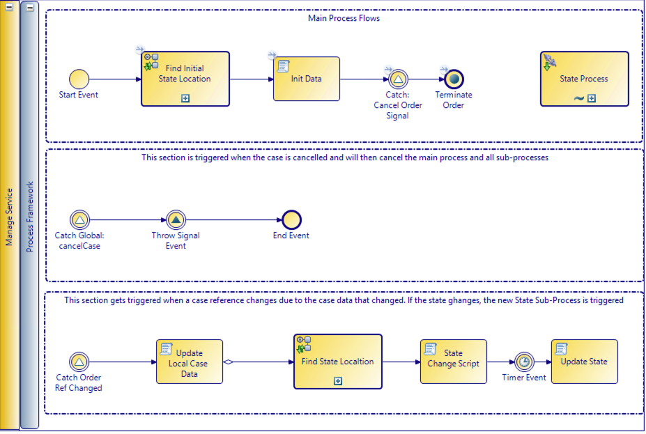

# Forms Project (_forms)
Forms project allow you to create one central place for embed-able forms (forms that are reusable). It makes it very easy to create user interfaces that are consistent throughout your project if you create embed-able forms that is reused in your project. It is a good idea to create a embed-ab;le form for every case or global class in your project and reuse it where needed. This way you can format the form the way you need and then just reuse. Formatting forms some times takes time and having to do this over and over can lead to longer than expected implementation times.

## Pageflows
Pageflows can re reused just like embed-able forms. Again this speeds up development. Putting pageflows into the forms project keeps all your UI related processes and artifacts in a single project and it allows for speeding up development. Pageflows are often used for CRUD functionality that can be called from process tasks, business services as well as case actions. 

# Main Process (_process)
The main process will be responsible for orchestrating all the lifecycle processes. Below is a good example of this process. It probably looks very complicated as you cannot really follow a process but its is really simple and we will review and use it in this workshop.

 