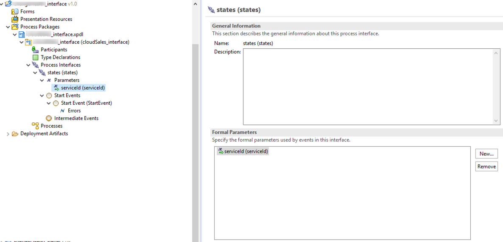

# Interface Project (_interface)
Process Interfaces allows for late binding of sub-processes and therefore the sub-processes are not statically linked into the main process at design time. 
The interface provides a template for the sub-process input and output parameters. It is a best practice to create a separate project for interface files. There is no special project for interfaces so a BPM Process project is used for this purpose. 

 

 Lets start building the signal project (_signal)
## Next Step: [Building the signal project](signal_Project.md)
