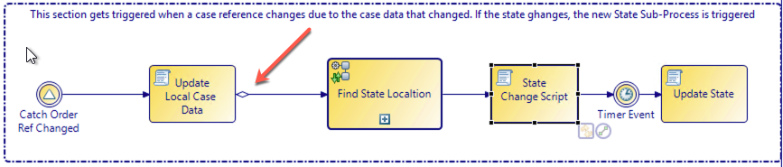
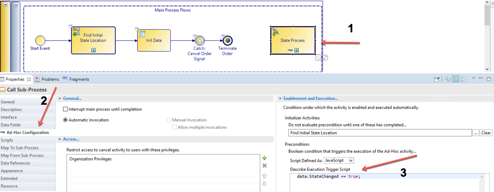

# 3 Sections of thew main process
## Main Process Flow
 The main process flow is responsible to keep the lifecycle process for the case alive. The start event complete script is responsible for initializing process data. The case data field is one of these data elements initialized. Through this data field, all changes in state is monitored and the relevant sub-process triggered.
 
 The case data is retrieved from the bpm engine  through a find case script function. The case state is passed to the find state location sub-process. This sub-process is a process in the service process explained little later in this page.  The Find State Location sub process sets a runtime_id field that is used by the ad-hoc sub process. This location tells the main process, which sub-process to use for the initial state sub-process. 

 Once the initial state is determined, the Init Data script task sets the data and tells the ad-hoc sub-process that it needs to trigger the first sub-process. Some debugging in this init data script is very useful to make sure everything is going according to plan.

 The section that initializes data in this script looks like this.

    data.cCaseId = data.serviceId;
    data.ServiceRef = bpm.caseData.findByCaseIdentifier(data.serviceId,'com.xxx_bom.Service');
    data.Service = bpm.caseData.read(data.ServiceRef);
    data.StateChanged = true;

Logging data looks like this.

    Log.write("********** Debug initial data **********");
    Log.write("Runtime Id 	: " + data.runtimeId);
    Log.write("Order State 	: " + data.Service.state);
    Log.write("Order Id 	: " + data.serviceId);
    Log.write("cOrder Id 	: " + data.cCaseId);
    Log.write("StateChanged : " + data.StateChanged);

In order to see the logged data, you need to look at the tibco/bpm/runtime:5.0.0 container logs.

When the data is initialized, the main process flow is processed to a catch event that simply waits for the process to be cancelled. 

## Catch Cancel Event
 The catch cancel event simply waits for an event to be triggered from somewhere in bpm or from a BW/REST service task. A good example for this is if a support ticker process is in progress and the customer figured out what the problem is and he wants to cancel the support ticket. This event will terminate the main process flow and end the lifecycle of the process. In your implementation you can decide to leave the data in the case tables or to archive it. This is beyond the scope of this workshop.

## Case Data Change Event
This section is what drives the changes of the process states/lifecycle events/processes. The catch case data change event listens to all updates to the case data reference field in the process. A case reference has a version associated with it. Once the version changes, the catch case data change is fired. 

The first script task in this section reads the data from the new case reference field. This will then indicate if the case state has changed. 

    data.Service = bpm.caseData.read(data.ServiceRef);

if the new data state is different from the existing state, it means the state has changes. The arrow in the image below shows a conditional line evaluating state change data field. 
    
    data.Service.state != data.CurrentState;

Only if the state has changed, will the next task be executed. The input to this sub-process is the name of the new state, and the output is the location of the new state sub-process in the runtime id field.  

The state Change Script sets the data field "stateChanged" to true. The stateChanged data field update triggers the Ad-Hoc sub-process. This is configured in the ad-hoc sub-process configuration tab in the Describe Execution Trigger Script field. See below.

