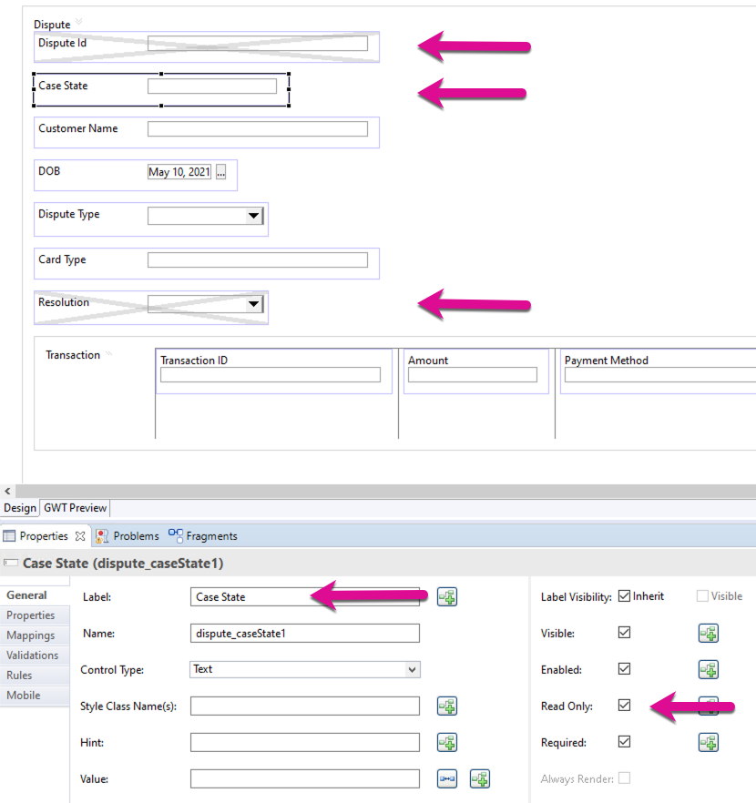
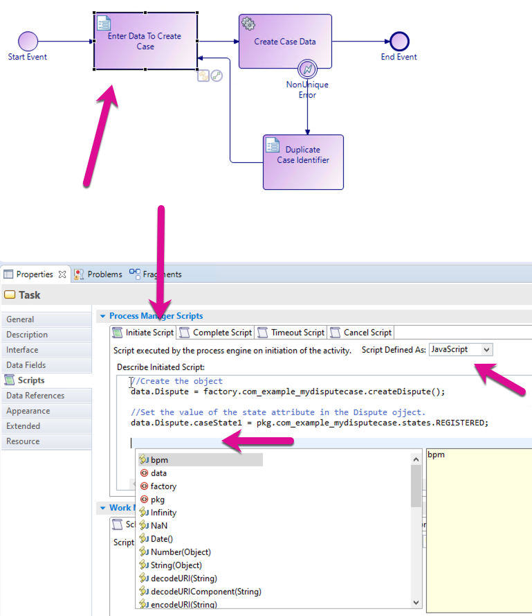
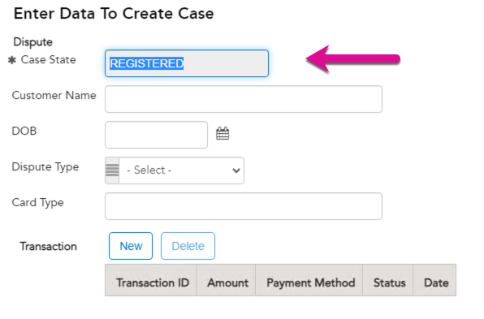

## Refining the project
Let's refine our project a little and explore some UI capabilities.

We made the following changes.
1. In this screen we changed the visibility of the Dispute Id field to false, which means it will not be visible when the form is displayed to the user.
2. We made the Case State field a text box, we made the text box Read-Only and 
3. We renames the caseState1 field for Case State, which makes it more user-friendly.
4. We changed the visibility of the Resolution field to false, as the user that captures the dispute does not need to see this field.



Let's also make a process field change. For this, we will preset the Case State field to Registered to indicate that the case was created and it is a registered case in the system.

TIBCO BPM Enterprise only uses JavaScript for all scripting. There are 3 places to create scripts in BPM Enterprise. 
1. Script task in the process: this is used if you want to initialize data or do some data manipulation for subsequent tasks in the process. 
2. On every task in a process you can create Process level scripts for events like initial, Complete, Timeout, and a canceling script. These are evaluated when the process executes. 
3. On user tasks you can also create Work Manager Level Scripts. There are evaluated when a user task executes. Scripts for the following events are available. Schedule, Reschedule, Open, Close, and Submit. 

To set the Case State to we can it anywhere but in our case, we want to set it before the user task is displayed to the user. If you want to set the value of a case data field before it was displayed to a user, you will need to initialize the data field. If you want to set a case data field after it's been processed through a user task, you don't need to do that as the user form does the initialization for you. 

We will do this on the Process Manager Initiate Script to illustrate creating an object.

Select the Enter Data to Create Case user task. Make sure the Process Manager Script is expanded. Click the Initiate Script Tab and change the Script Defined as: to JavaScript. Enter the following 2 lines

TIBCO BusinessStudio provides code auto-complete. You may be familiar with this if you are used to the Eclipse framework. By clicking ctrl-space you should see the autocomplete section open up. In this case, you can see the following predefined variables. 

data: this is for accessing and data that you as the developer created. 
factory: this is for accessing the creators/initializers of the data that you created. 
pkg: this is for accessing the enumeration values for setting enum field values. 

```
//Create the object
data.Dispute = factory.com_example_mydisputecase.createDispute();

//Set the value of the state attribute in the Dispute ojject.
data.Dispute.caseState1 = pkg.com_example_mydisputecase.states.REGISTERED;
```

You have to use the package variable to set an enumeration. You cannot use plain text.



Re-deploy and test your application. Your capture form should now look like this. You will see the Dispute Id Field is gone, the Case State has been renamed, Case State has been re-defined as a read-only text field and finally, the Resolution field is hidden.



Next Step: Users will be defined in the Organizational Model to allow work to be offered to the Dispute Advisor Position for completion.

## Next Step: [Create Org Model](create_Organisation_Project.md)