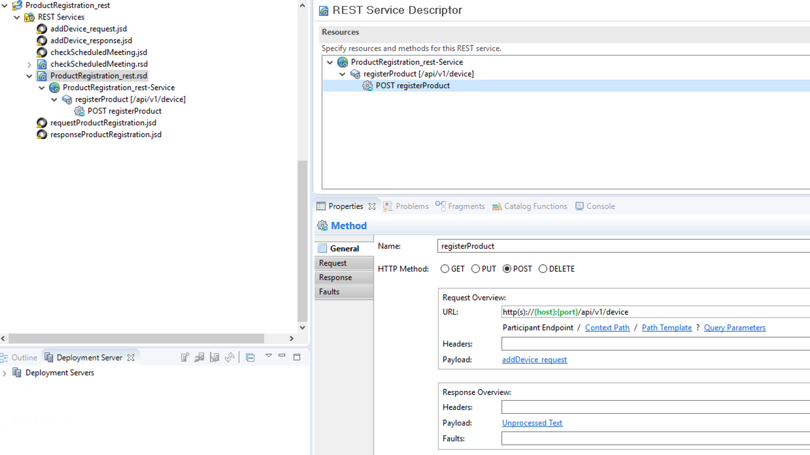
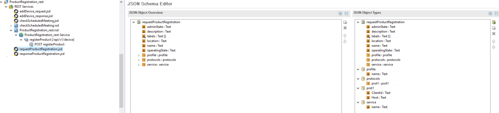
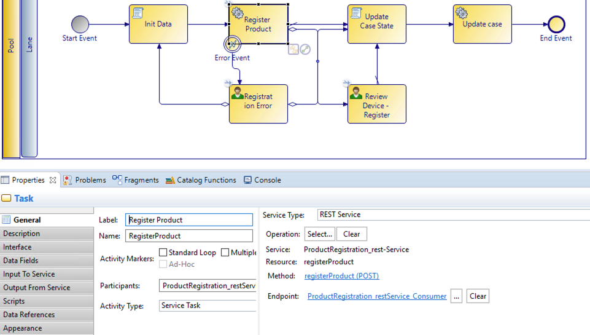

# Rest Services Project (_rest)

A REST service project is required to execute a REST service from a process task. This project defines the interface for the REST service, including the REST URL, the request, and response formats.
The screenshot below shows a configuration of a REST project.

 

A rest service operation required request as well as response data. Below is an example of a request payload configuration.

 

 See below the configuration of the activity that will trigger the rest project configured above. What's left to do is to complete the mapping ot the data fields in the Input to service and Output from service tabs.

  

## Trigger Process As a REST Services
This is a critical part of any BPM solution. This is not done through the REST service project.  API Explorer explains the API but not the data payload. We created some sample documentation and BWCE project ware that will be supplied on request to explain the calling of a process as a rest service.

## Rest from User forms
There is often a requirement to call a Rest service directly from a form rather than a service task in a pageflow. One example is to populate an option list in a form as the user types data into a control. This is also not done through the rest service project. The same documentation mentioned above explains and illustrates this implementation.
