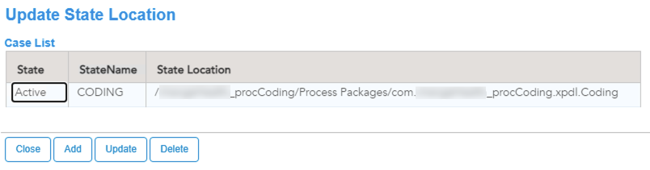

# Services Business Object Model (_servicesBom)

The services bom project is used to create the lookup tables that determine the process execution of the main process lifecycle/state processes.

2 case tables are created in the services bom project. State Locations are used to determine the location of the dynamic sub process that is responsible for processing a state. These processes are exposed through an interface. In the case management framework, we use one parameter to trigger state processes. The parameter points to the id of the main case. 

Lets start building the services process project (_servicesProcess)
## Next Step: [Building the services process project](services_Process_Project.md)