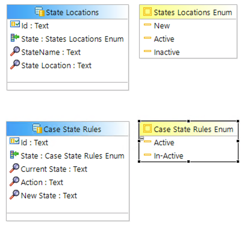
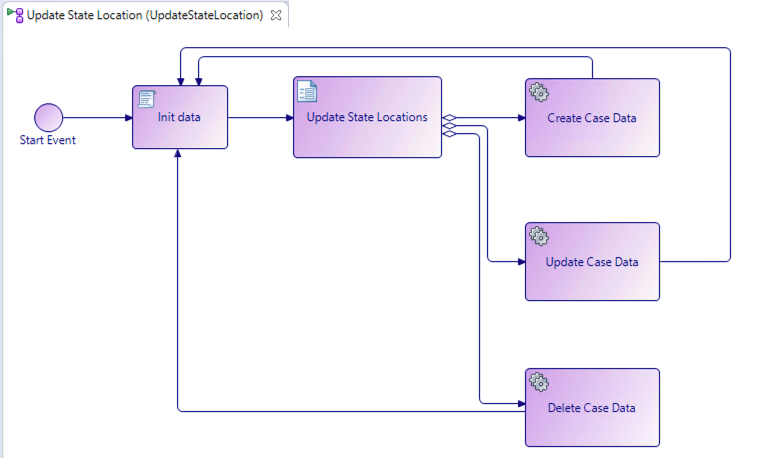

# Services Projects (_services)

The services project is responsible for updating the state location lookup, case state tables (see screenshot below) as well as the service processes that will be used to search for the current and future case statuses.

 
 
 State lookup tables

 ## Process to maintain the state location table. 
 This process is exactly the same for updating the state rules table. It is a CRUD process that is exposed as a business service.  

 
 Update Sate Location Process

 Lets review the process step by step then you will go ahead and create the same process for the dispute process.

 ### Init Data
 The Init Data script task is responsible for 2 operations.
 1. Retrieving the current state locations from the lookup table 
 2. initializing the option lists that will be displayed in the subsequent user form

Script outline below should be self explanatory

    //Clear current array fields
    data.CaseList.length = 0;
    data.CaseRefList.length = 0;

    //Lookup and pupulate current state locations into process data field
    data.CaseRefList.pushAll(bpm.caseData.findAll('com.services_bom.StateLocations',0,20));
    if (data.CaseRefList.length >0) {
        data.CaseList.pushAll(bpm.caseData.readAll(data.CaseRefList));
    }

    //Populate option list array values
    data.StateList.length = 0;
    data.StateList.push("SCHEDULING");
    data.StateList.push("REGISTRATION");
    data.StateList.push("ELIGIBILITYAUTH");
    data.StateList.push("CHARGECAPTURE");
    data.StateList.push("CODING");
    data.StateList.push("CLAIMSUBMISSION");
    data.StateList.push("PAYMENTROCESSING");
    data.StateList.push("INSURANCEFOLLOWUP");
    data.StateList.push("PATIENTCOLLECTIONS");

