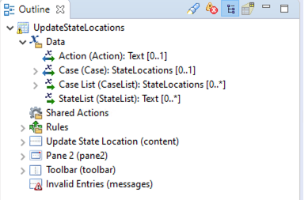
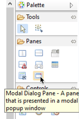
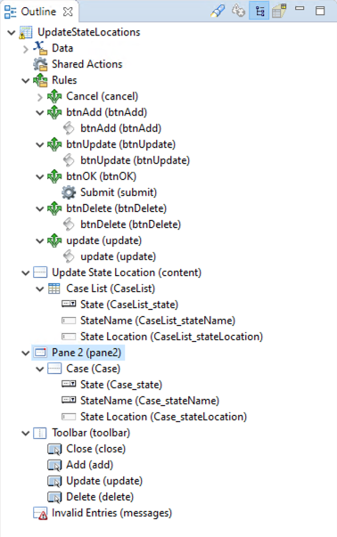

# Services Projects (_services)

The services project is responsible for updating the state location lookup, case state tables (see screenshot below), and the service processes that will search for the current and future case statuses.

 
 
 State lookup tables

 ## Process to maintain the state location table. 
 This process is the same for updating the state rules table. It is a CRUD process that exposes as a business service.  

 
 Update Sate Location Process

 Let's review the process step by step; then, you will create the same process for the dispute process.

 ### Init Data
 The Init Data script task is responsible for two operations.
 1. Retrieving the current state locations from the lookup table 
 2. initialize the option lists that display in the subsequent user form

Script outline below should be self-explanatory.

    //Clear current array fields
    data.CaseList.length = 0;
    data.CaseRefList.length = 0;

    //Lookup and populate current state locations into process data field
    data.CaseRefList.pushAll(bpm.caseData.findAll('com.services_bom.StateLocations',0,20));
    if (data.CaseRefList.length >0) {
        data.CaseList.pushAll(bpm.caseData.readAll(data.CaseRefList));
    }

    //Populate option list array values
    data.StateList.length = 0;
    data.StateList.push("SCHEDULING");
    data.StateList.push("REGISTRATION");
    data.StateList.push("ELIGIBILITYAUTH");
    data.StateList.push("CHARGECAPTURE");
    data.StateList.push("CODING");
    data.StateList.push("CLAIMSUBMISSION");
    data.StateList.push("PAYMENTROCESSING");
    data.StateList.push("INSURANCEFOLLOWUP");
    data.StateList.push("PATIENTCOLLECTIONS");

### Update State Locations user task
First, we need to create and add some data fields to the interface of the user task.

 

Now create a new user task and add the following fields to the user task called "Update State Locations."

When you are complete, right-click the user task, click Form -> Open.

We will create a form that looks like this.

Expand your Data section; bottom left corner in Outline. 

Drag and drop the Case List parameter on your Form. You can now change the properties of the pane as you like it. Mine looks like the image above.

Next, expand your Palette on the right and select the Modal dialog. Put it between the "Update State Location" and the toolbar. You can click on the tool and release and then point your mouse pointer at the location where you want to drop the control and click. This is not a standard drag-and-drop action and sometimes takes a little while to get used to.

. 

Next, you can drag and drop the Case parameter from the Data section in your Outline to the modal pane. You may require a couple of drag operations before you succeed.

Next, you need to add a couple of buttons to your toolbar. The close button should already be there. Add an "Add," "Update, and "Delete" button to resemble my Form.

Next, you need to create a rule that fires every time a user clicks on it. My rules look like this.

#### Add

    //Populate the Action parameter with the value "add." The process will use this in a conditional line to execute the add case data
    data.Action = "add";

    //Create a newCase temporary variable that will be stored in the Case data fields
    var newCase = factory.com_services_bom.createStateLocations(); 

    //Store the value "ACTIVE" state of the new case parameter. This value needs to be in all caps. ENUM field values are stored in caps. 
    newCase.state = "ACTIVE";

    //Rename the modal dialog pane heading
    pane.pane2.label = "Add State Location";

    //Store the temporary newCase value in the Case Parameter
    data.Case = newCase;

    //Open the modal dialog pane
    pane.pane2.open();

#### Update

    data.Case = pane.CaseList.selection;
    data.Action = "update";
    pane.pane2.open();  

#### Delete
The delete action does not open the modal dialog. It simply sets the action value and the case parameter value to tell the engine which case element needs to be deleted.

    data.Action = "delete";
    data.Case = pane.CaseList.selection;

    //this line submits the form
    context.form.invokeAction("submit",context.form,context);

#### OK button on the Modal Form
To complete the action, you need to add an OK button rule for the modal Form on the close event. This is done with an action or a script. See screenshots below.

. 
. 

When done, your form outline should look more or less like this.

. 

Now let's update add the Global case data actions.

Add the three case data operation service tasks like in the screenshot above.

#### Create Case

 

 #### Update Case

 

 #### Delete Case

 

 Also, add conditional sequence flows to these steps. 

    data.Action == "add";
    
    and 

    data.Action == "update";

    and 

    data.Action == "delete";

Lastly, we need to add a couple of script tasks for the service tasks we just created. Also, make sure all the sequence flows are drawn like the image below.

On the Update Case Data and Delete Case Data Initiate scrips add the following line.

    //Searches the case based on the id that was selected on the form.
    data.CaseRef = bpm.caseData.findByCaseIdentifier(data.Case.id,'com.services_bom.StateLocations');

This is a good CRUD pattern process I often use for maintaining data in simple lookup tables. You will come to realize that you use lookup tables a lot on BPM solutions.

Now create a similar process for maintaining the state rules case data table.