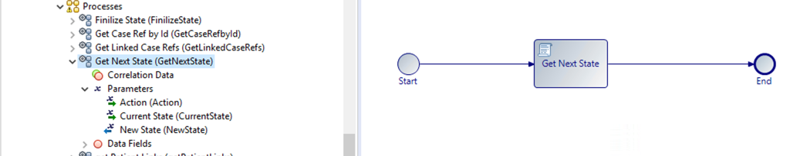

# Service Processes 
Service processes are processes that are integration processes very similar to BusinessWorks. The benefit is that you do not have to create all the services interaction that you normally have to do when implementing a BW rest service. The difference from BPM processes is that it does not audit the process step execution. If you absolutely need auditing you will have to manually add it. 

In this project we will create services processes to do searching of cases. This is something that requires a lot of scripting that may be time consuming. Creating a service process for searching allows you to create once and reuse multiple times. See below the services processes we will be using in a dynamic process like we are working on.

This is one example of a process that finds a case reference by case id.

    if (data.ServiceId != "") {
	data.InsuranceRef = bpm.caseData.findByCaseIdentifier(data.ServiceId,'com.changehealth_bom.Service');
}

This one is something you will use to find the next state from the Case State Rules table.

Make sure you add the parameters as indicated in the image above. You will notice i make use of Log.write quite a lot. This halps you to debug the application by looking at the BPM container logs.

    Log.write("********** getNewState **********");	
    Log.write("Current State 			: " + data.CurrentState);
    Log.write("Action 				: " + data.Action);

    data.NewState = "";
    var searchString = "";

    if (data.Action == "null" || data.Action == null ) {
        searchString = "currentState = '" + data.CurrentState + "'";
    } else {
        searchString = "currentState = '" + data.CurrentState + "' and action = '" + data.Action + "'";
    }

    //var searchString = "currentState = '" + data.CurrentState + "' and action = '" + data.Action + "'";
    Log.write("searchString 			: " + searchString);
    
    data.CaseRefList.pushAll(bpm.caseData.findByCriteria(searchString,'com.services_bom.CaseStateRules',0,1));
    data.CaseList.pushAll(bpm.caseData.readAll(data.CaseRefList));

    Log.write("CaseList.size() 	: " + data.CaseList.length);
        
    if (data.CaseList.length > 0 ) {	
        data.NewState = data.CaseList[0].newState;
    }
    Log.write("New State 		: " + data.NewState);

Get state location is used to see the location of the dynamic sub-process associated with a case state. Remember to add the parameters as indicated. 

    Log.write("********** Get States Location **********");
    Log.write("State 			: " + data.State);

    data.CaseRefList.pushAll(bpm.caseData.findByCriteria("stateName = '" + data.State + "'",'com.services_bom.StateLocations',0,10));
    Log.write("data.CaseRefList.length : " + data.CaseRefList.length);
    data.Case = bpm.caseData.read(data.CaseRefList[0]);
    data.StateLocation = data.Case.stateLocation;

    Log.write("StateLocation 	: " + data.StateLocation);
