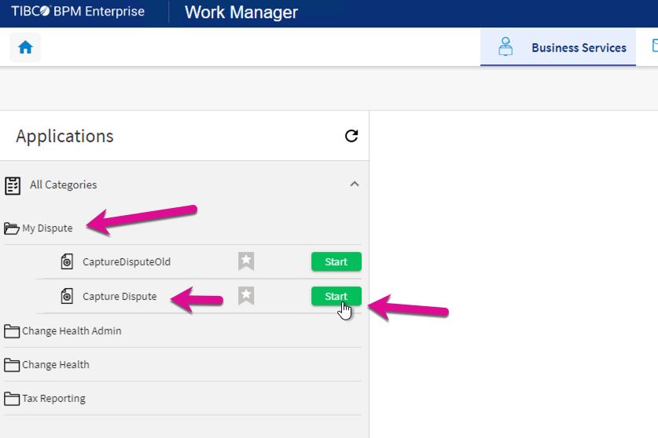
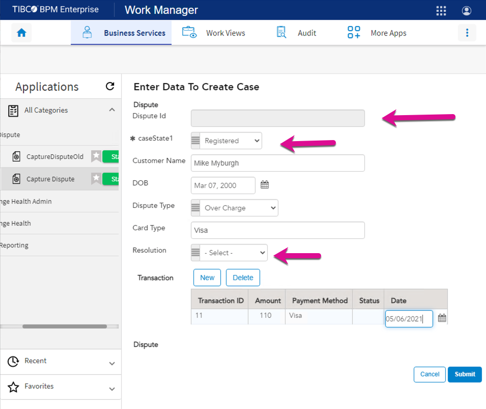
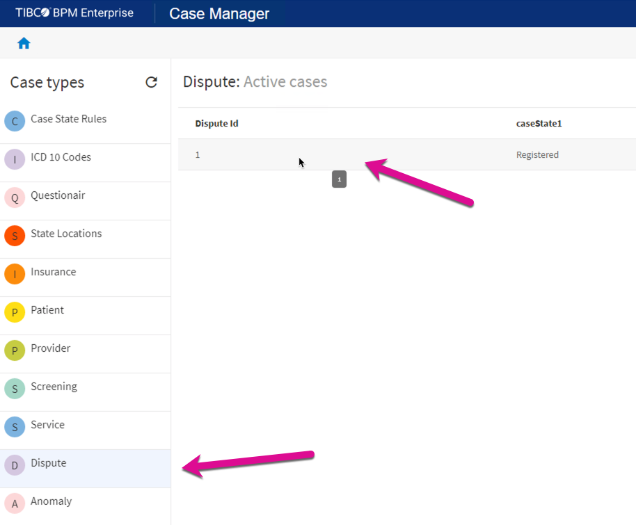
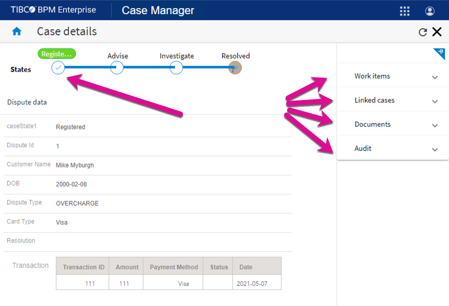

## Testing your solution
Open the BPM Work Manager - http://localhost/apps/work-manager/#/overview, and navigate to the Business Services Section.
Expand the My Dispute Category and select start Capture Dispute.

You will notice a couple of things on this form. 
1. The Dispute Id is blank.
- The "case id" is created when the case is created. It is best practice to hide fields that are not required. 
2. The Case State label is in a nonbusiness user-friendly format, and this field should, in any case, be pre-populated in a script task and be read-only. 
3. The Resolution is displayed on this form, and it should not be visible to the customer. 

We will fix these issues a little later. 

Now open the Case Manager (http://localhost/apps/case-manager/#/cases) and Select the "Dispute Case"

Notice that the number of columns in the case list is limited to "Dispute Id" and "CaseState1". The data model can be configured to show more summary fields to the end-user. We will get to that a little later. Click on case number one and review the case data. 

Congratulations, you have created, Deployed, and tested your first project. 

Next Steps: Fix issues and enhance solution to include a case action.
## Next Step: [Refine Solution](refine_Project.md)